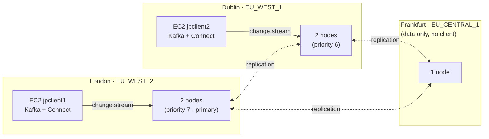
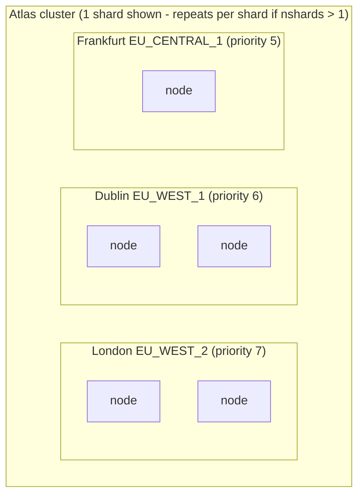
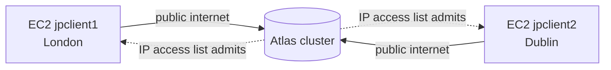
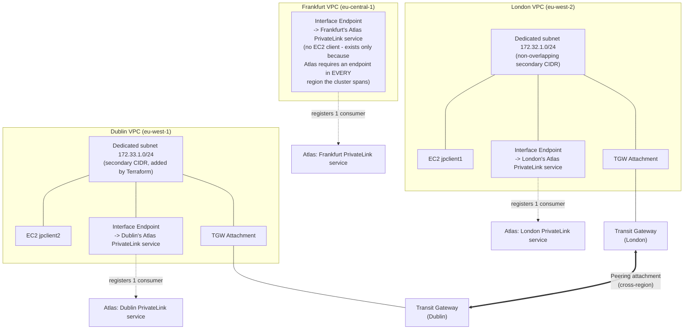
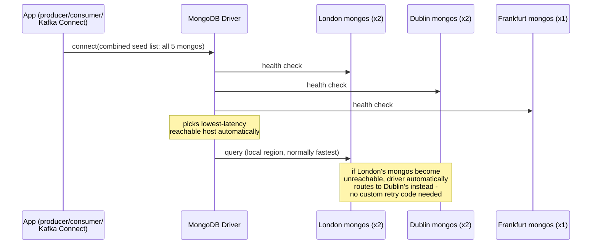
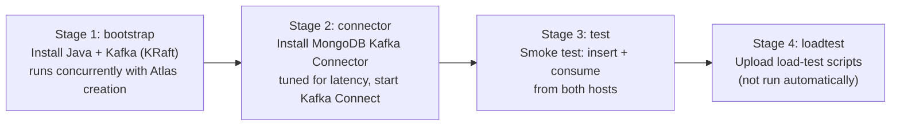

# DistKafka — Architecture

Diagrams in this document use [Mermaid](https://mermaid.js.org/), which
renders natively in GitHub, GitLab, and VS Code's built-in Markdown
preview — no extra tooling needed to view them.

## Overview

Provisions a MongoDB Atlas cluster spread across 3 AWS regions, plus 2 EC2
application hosts (London + Dublin) each running their own local Apache
Kafka broker and a MongoDB Kafka Source Connector watching the same
`bank.payments` collection. Everything is Terraform; host configuration is
bash provisioner scripts uploaded and run over SSH.

Two operating modes, toggled by `var.privatelink_enabled`:

- **Public mode** (default) — EC2 hosts reach Atlas over the public
  internet, admitted via an IP access list.
- **PrivateLink mode** — EC2 hosts reach Atlas entirely over AWS
  PrivateLink, with a Transit Gateway link providing cross-region
  failover if one region's endpoint becomes unavailable.



---

## File Layout

```
terraform/
├── versions.tf              Provider pins + required_version >= 1.8.0
├── providers.tf              AWS (default/london/ireland/frankfurt aliases)
│                              + MongoDB Atlas providers, default_tags,
│                              ignore_tags, my-IP lookup, sharding defaults
├── variables.tf               All variables with descriptions + validation
├── atlas.tf                   Atlas cluster, database user, IP access list,
│                              PrivateLink endpoints (per-region + gated)
├── ec2.tf                     EC2 instances, security groups, Route53 DNS,
│                              SSH key pair, Elastic IPs, PrivateLink
│                              VPC endpoints + dedicated subnets
├── transit_gateway.tf          Cross-region TGW peering (London <-> Dublin)
│                              for PrivateLink failover
├── provisions.tf              Four-stage provisioning pipeline + the
│                              combined mongos connection-string logic
├── outputs.tf                 Connection strings, IPs, hostnames, SSH commands
├── terraform.tfvars            Non-sensitive variable values (gitignored)
└── scripts/
    ├── setup-kafka.sh           Install Corretto JDK + Kafka (KRaft mode)
    ├── setup-connector.sh       Install MongoDB Kafka Connector, tuned for latency
    ├── producer.py / consumer.py            Smoke-test scripts
    ├── load_producer.py                     Concurrent load-test producer
    ├── load_consumer.py                     Load-test consumer (per host)
    ├── compute_load_stats.py                Latency stats (screen + JSON)
    ├── run_load_test.sh                     Single-host orchestrator
    └── run_multiregion_load_test.sh         Runs from your laptop -
                                              producer in London, simultaneous
                                              consumers in both regions
```

---

## Atlas Cluster Topology

Every shard (or the single replica set, if not sharded) uses the **same
2/2/1 cross-region distribution**:

| Region | Priority | Electable nodes |
|---|---|---|
| `EU_WEST_2` (London) | 7 (highest — primary lives here) | 2 |
| `EU_WEST_1` (Dublin) | 6 | 2 |
| `EU_CENTRAL_1` (Frankfurt) | 5 | 1 |



- `var.nshards = 0` (default): a plain 5-node replica set, this layout once.
- `var.nshards >= 1`: a sharded cluster; **each shard** gets this same 2/2/1
  layout (not one shard per region — every shard is itself spread across
  all 3 regions for uniform regional resilience).
- `var.privatelink_enabled = true` **forces sharding** (minimum 1 shard,
  embedded config servers by default) regardless of `var.nshards`, because
  PrivateLink's cross-region failover design (below) depends on `mongos`
  query routers, which only exist in a sharded cluster.

| Transition | Supported? | Notes |
|---|---|---|
| `nshards 0 → N` | Yes | In-place upgrade, no data loss. |
| `nshards N → 0` | **No** | Requires destroy + re-apply — full data loss. |
| `nshards N → M` | Yes | Atlas adds/removes shards; removing requires manual `db.dropShard()` first. |

---

## EC2 Hosts

| Hostname | Region | Public DNS | Role |
|---|---|---|---|
| `jpclient1` | `eu-west-2` (London) | `jpclient-london.mongosa.net` | Same region as Atlas primary |
| `jpclient2` | `eu-west-1` (Dublin) | `jpclient-ireland.mongosa.net` | Secondary region |

- **AMI:** Amazon Linux 2023
- **Instance type:** `t3.medium` (default — `t3.small`'s 2GB RAM isn't enough
  to run both the Kafka broker JVM and the Kafka Connect JVM without
  hitting the OOM killer; see [Lessons Learned](#lessons-learned--real-world-gotchas))
- **Elastic IP + Route53 A record** per host, so the hostname makes the
  region obvious without needing to remember which IP is which
- Each host runs **its own independent** Kafka broker (KRaft mode, no
  ZooKeeper) + Kafka Connect worker — both hosts receive the same Atlas
  change stream independently, they don't share a Kafka cluster

---

## Networking

### Public mode (`privatelink_enabled = false`, default)



Each host's Elastic IP is added to `mongodbatlas_project_ip_access_list`.
Simple, no extra infrastructure, but traffic traverses the public internet
(TLS-encrypted, but still public routing).

A separate `mongodbatlas_project_ip_access_list.deployer` entry (the
deployer's own static IP, reusing `local.my_cidr`) is **always** present
regardless of `privatelink_enabled`, for admin/debugging access independent
of the EC2 hosts - this project's access list previously had an
un-Terraform-managed `0.0.0.0/0` entry (literally open to the entire
internet), found and replaced with this scoped entry.

### PrivateLink mode (`privatelink_enabled = true`)

This is the interesting one, and took several rounds of real debugging
against actual AWS/Atlas behavior to get right — see
[Lessons Learned](#lessons-learned--real-world-gotchas) for the full story
of what didn't work and why.



**Why this exact shape:**

1. **Both regions' *default* VPCs share the identical `172.31.0.0/16`
   CIDR** (standard for AWS default VPCs). VPC-to-VPC routing — whether
   TGW or peering — fundamentally requires non-overlapping address
   space, so a dedicated secondary CIDR was added to each VPC
   (`172.32.0.0/16` London, `172.33.0.0/16` Dublin) purely to host a
   small subnet for this cross-region traffic.
2. **Both the EC2 instance and its region's PrivateLink endpoint live in
   that same dedicated subnet.** Originally only the *endpoint* was
   moved there — that fixed the forward path, but the *return* path
   still failed, because from the peer VPC's perspective `172.31.0.0/16`
   is its own local range, so it would never route return traffic for
   it out over TGW. Moving the instance too (not just the endpoint)
   fixed this — see the full story below.
3. **Atlas allows only one consumer attachment per regional PrivateLink
   service.** This is why there's no *second*, cross-region-native
   endpoint per region — Atlas's API flatly rejects that ("Projects
   with private endpoints in multiple regions cannot support more than
   one endpoint in each region"). Cross-region reachability instead
   comes entirely from the Transit Gateway peering link routing traffic
   to the *one* already-registered endpoint, which Atlas never sees as
   a second consumer.
4. **Frankfurt gets an endpoint too, with no EC2 client** — Atlas only
   populates private connection strings once *every* region the cluster
   spans has a private endpoint; it's all-or-nothing across the whole
   cluster, not per-region.

### Combined seed-list failover

Both hosts get **the same connection string** — Atlas's own
PrivateLink SRV record (`connection_strings.private_endpoint[0].srv_connection_string`,
e.g. `mongodb+srv://distkafka-cluster-pl-0.<id>.mongodb.net`), which
resolves (via DNS SRV+TXT) to every `mongos` router across all 3
regions. `provisions.tf` just adds credentials and `readPreference` -
no manual host-list expansion needed.



This works specifically **because the cluster is sharded**: `mongos`
routers are stateless query routers with no "peer discovery" the way
replica-set members have, so combining routers from multiple regions
into one seed list is safe — the driver just uses whichever ones are
reachable. The same combined URI is handed to the Kafka Connector too
(it builds its `MongoClient` straight from `connection.uri`), so it gets
this failover for free as well.

---

## Provisioning Pipeline

Four sequential-ish stages (stage 1 runs concurrently with Atlas cluster
creation to save time):



### Stage 2 connector tuning

`setup-connector.sh` deliberately overrides two mongo-kafka connector
defaults:

- `poll.await.time.ms=50` (default `5000`) — don't let the connector sit
  idle for up to 5 seconds before returning an empty batch.
- `poll.max.batch.size` is **left at its default (`1000`)**, not lowered.
  Forcing it down to `1` was tried and made latency *worse* under
  concurrent/bursty load — the connector could then only pull one
  change-stream event per poll cycle even with hundreds already
  backlogged, becoming a single-item queueing bottleneck. A large batch
  size lets it drain a backlog in one go.

`setup-connector.sh` also installs `mongosh` on both hosts (downloaded
directly from MongoDB's official RPM, not via a yum repo) - useful for
ad-hoc inspection using the exact same combined multi-region connection
string already sitting in `.env`:

```bash
set -a; source .env; set +a
mongosh "$MONGO_URI" --eval "db.hello()"
```

---

## Load Testing

See the README's [Load Testing](README.md#load-testing) section for full
usage. Summary of the tooling:

| Script | Runs where | Purpose |
|---|---|---|
| `run_load_test.sh` | On one EC2 host | Single-host producer + consumer + stats |
| `run_multiregion_load_test.sh` | Your laptop, via SSH | Producer in London, simultaneous consumers in both regions |
| `compute_load_stats.py` | Either | Prints + writes JSON: 4 latency metrics |

The four latency metrics (see `compute_load_stats.py`'s own docstring for
the full reasoning):

1. **Insert time** — the client's full `insert_one()` round-trip.
2. **Mongo visibility time** — `write_ts_ms` → the change event's own
   server-side `wallTime` (majority-commit moment).
3. **Kafka pipeline time** — `wallTime` → consumer receipt (Kafka
   Connect + broker + consumer only).
4. **Create to receipt** — full end-to-end total.

(2)+(3) are anchored on the change event's own `wallTime` rather than
naively subtracting the client's insert round-trip from the total —
part of that round-trip happens *after* the write is already visible
(the ack traveling back to the client), so the naive subtraction can
(and did) go negative.

---

## Lessons Learned / Real-World Gotchas

Kept here deliberately, because every one of these was a real failure
discovered by actually running things, not anticipated in advance —
useful context if you're extending this further.

| Problem | Root cause | Fix |
|---|---|---|
| `unzip: command not found` | Not installed by default on this AMI | Install via `dnf`/`yum` before use in `setup-connector.sh` |
| `pip3: command not found` | Only `python3-pip-wheel` (a stub) is preinstalled, not `pip3` itself | Same - install `python3-pip` explicitly |
| Kafka Connect OOM-killed | `t3.small` (2GB) can't fit both the Kafka broker JVM and Connect JVM | Bumped default to `t3.medium` (4GB) |
| `nc -z` silently "failing" forever | `nc` isn't installed either, and `set -e` doesn't apply to `if` conditions - the missing-binary error was swallowed | Used bash's built-in `/dev/tcp` instead of depending on `nc` |
| Consumer always saw the wrong topic | Connector's default `topic.prefix` naming produces `<prefix>.<db>.<collection>`, different from the manually pre-created topic | Used `topic.namespace.map` to pin the exact topic name explicitly |
| Consumer silently dropped every message | `output.format.per-operation=true` + `JsonConverter` double-JSON-encodes the value; a single `json.loads()` only unwraps the outer layer | Unwrap twice when the first decode yields a `str` instead of a `dict` |
| Negative "Kafka transit time" | Subtracting the client's full insert round-trip from the total over-corrects - part of that round-trip happens *after* the write is already visible | Anchor on the change event's own `wallTime` field instead (see Load Testing above) |
| Atlas rejected the 4th/5th PrivateLink endpoint link | Atlas allows only **one consumer attachment per regional PrivateLink service** - confirmed via a real rejected API call, not documented anywhere obvious | Redesigned to use Transit Gateway for cross-region reachability instead of a second Atlas registration |
| A "failed" Terraform apply had actually succeeded on Atlas's side | The API call went through but Terraform's own state update never completed (dropped connection/timeout) | Used a Terraform `import` block to reconcile state instead of retrying blindly |
| TGW routes rejected: "equal to or more specific than VPC's own CIDR" | Both regions' default VPCs use the identical `172.31.0.0/16` range - AWS refuses routes into your own local CIDR | Added dedicated non-overlapping secondary CIDRs per region purely for the PrivateLink/TGW subnet |
| Cross-region connectivity still failed after that fix | Endpoint-only relocation fixed the forward path but not the *return* path - the peer VPC still treats the original overlapping range as local | Moved the **EC2 instances** into the dedicated subnets too, not just the endpoints |
| A specific route silently had no effect | London's default VPC (this account) had a **pre-existing, unrelated custom route table** association on its original default subnet, discovered only by testing actual TCP connectivity rather than trusting the plan | Moving the instance into the new dedicated subnet (which uses the VPC's implicit main table) sidestepped this entirely |
| Cluster was reachable from literally anywhere on the internet | An un-Terraform-managed `0.0.0.0/0` entry existed in the project's IP access list (not added by this repo's Terraform - likely leftover from manual UI use), fully undermining the point of restricting access to specific hosts | Imported it into Terraform via an `import` block, then removed it declaratively and replaced it with the deployer's own scoped static IP |

---

## Variables

| Name | Default | Description |
|---|---|---|
| `atlas_project_id` | *(required)* | Existing Atlas project ID |
| `atlas_cluster_name` | `"distkafka-cluster"` | Cluster name in Atlas UI |
| `atlas_instance_size` | `"M30"` | Tier for electable nodes |
| `nshards` | `0` | 0 = replica set, >=1 = sharded (each shard gets the 2/2/1 regional layout) |
| `config_server_type` | `"embedded"` | `"embedded"` or `"dedicated"` |
| `atlas_disk_size_gb` | `0` | 0 = use Atlas default |
| `atlas_backup_enabled` | `true` | Enable Atlas cloud backups |
| `db_username` | `"distkafkaApp"` | Database user name |
| `db_password` | *(required)* | Database user password |
| `db_name` | `"bank"` | Application database (collection: `payments`) |
| `kafka_version` | `"4.3.1"` | Apache Kafka release (KRaft mode) |
| `kafka_topic` | `"bank.payments"` | Kafka topic the connector publishes to |
| `kafka_read_preference` | `"primary"` | Read preference for the Kafka connector's connection URI |
| `ec2_instance_type` | `"t3.medium"` | EC2 instance type (needs enough RAM for 2 JVMs) |
| `ec2_volume_size` | `20` | Root volume GB |
| `key_pair_name` | `"distkafka-ec2-key"` | AWS key pair name |
| `java_version` | `"21"` | Amazon Corretto major version |
| `privatelink_enabled` | `false` | Switch to PrivateLink + cross-region TGW failover (forces sharding) |
| `tag_owner` | `"john.page"` | Owner tag |
| `tag_purpose` | `"other"` | Purpose tag |
| `tag_expire_on` | `null` | Expiry (auto 48h from plan time if unset) |

---

## Outputs

| Name | Description |
|---|---|
| `atlas_cluster_name` | Cluster name |
| `atlas_connection_string_srv` | Public SRV connection string |
| `atlas_num_shards` | Current shard count |
| `jpclient_london_public_ip` / `jpclient_ireland_public_ip` | Elastic IPs |
| `jpclient_london_hostname` / `jpclient_ireland_hostname` | DNS hostnames |
| `ssh_private_key_path` | Path to generated SSH key |
| `ssh_command_london` / `ssh_command_ireland` | Ready-to-use SSH commands (with local port forwarding for Kafka 9092 + Connect 8083) |

---

## Future Extensions

- **Automatic fail-back**: currently, once the driver fails over to a
  remote region's `mongos`, there's no explicit "prefer local again once
  it recovers" logic beyond the driver's own periodic health checks.
- **TLS for Kafka**: add SSL listener config + cert generation for the
  broker itself (currently plaintext, relying on the security group for
  access control).
- **Confluent Schema Registry**: add as another provisioner stage.
- **Monitoring**: Grafana/Prometheus or Atlas Monitoring integration.
- **Frankfurt client**: if a third region ever needs its own EC2 client,
  it would need the same treatment as London/Dublin (dedicated subnet,
  TGW attachment, peering to both other regions).
